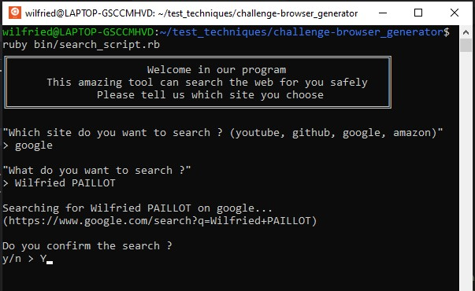

<h1 align="center">
Browser Generator
</h1>
<h4 align="center">Technical test for internship</h4>
<br>



## How to use this app

Clone this repository and navigate to the folder

``` cd challenge_browser_generator ```
  
Then, you can use the following command:
  
``` ruby bin/search_script.rb ```


You can also use the following command in the folder to see the life in green :)
  
``` rspec ```


## Used technology

<p align="left">For this application, i used Ruby OOP <br>
<a href="https://www.ruby-lang.org/en/" target="_blank" rel="noreferrer">  </a>
<br>
<br>

## Crédit 🔗
[Wilfried PAILLOT](https://github.com/WilfriedPaillot)